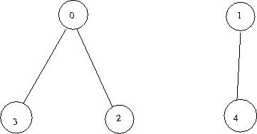
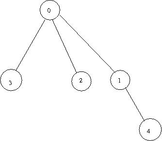

# GoGame
An 9X9 Go browser game written in React/Redux with game logic utilizing the Union-Find algorithm

## Frontend Structure  
The rendering of the game board is handled with React/Redux. Each position on the grid is represented
in the Redux state by an instance of `positionData` which keeps track of the color of the piece occupying that position
(if any) along with the positions and open liberties of that piece's group (all connected pieces of the same color).

````javascript
  constructor(stone, pos, initialize = true) {
    this.stone = stone;
    this.pos = pos;
    this.groupSize = 0;
    this.groupLiberties = initialize ? this.initializeGroupLiberties() : {};
    this.groupPositions = {[pos]: true};
    this.parentPiece = this;
  }
````

Each position on the board responds to a click by dispatching the action `PLACE_PIECE` to the Redux store, where the majority
of the game logic is handled. The reducer first creates a **Deep Clone** of the previous Redux state (see note below) and then
goes through the following steps:
1. set new stone
2. connect with adjacent stones of same color
3. remove liberty from connected pieces
4. remove liberty from adjacent empty spaces and opposing color groups
5. eliminate any opposing pieces if all liberties taken
6. check two conditions to make sure that the move was, in fact valid:   
    A. not a suicide move  
    B. does not violate the ko rule
7. If either of those two conditions are broken, return original state
8. Otherwise, return new state

````javascript
  newState.prevBoard = state.board;
  newState.nextPiece = (newState.nextPiece === 'BLACK' ? 'WHITE' : 'BLACK');
  return newState;
  break;
````

Note: The reason why we create a **deep Clone** of the previous Redux state is that it is difficult to check the final two
conditions (6A, 6B) without going through all of the previous steps (2 - 5), but those steps are not easily reversible.

## Game Logic, the Union-Find Algorithm  
The Union-Find algorithm is designed for representing connectivity in a graph of nodes as they are connected and disconnected
(precisely the situation in Go). This is done by creating an underlying tree structure of the nodes in the original graph.
Each `positionData` object has an instance variable `this.parentPiece` that is initialized to point to itself. This represents
its direct parent in the abstract tree structure. When any two pieces are connected, the root node of the tree that contains
one piece is set as the parent of the root node of the tree that contains the other piece.  

So, for example, if we were to connect nodes `2` and `4` in the trees below:  
  

the new tree structure would be  




HEY THERE
